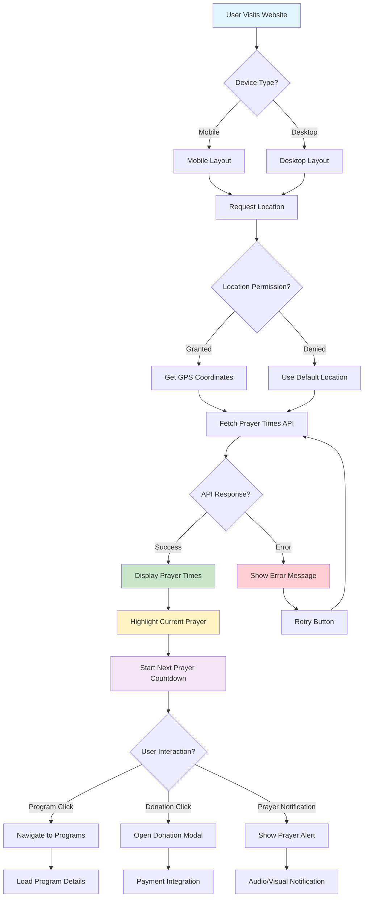
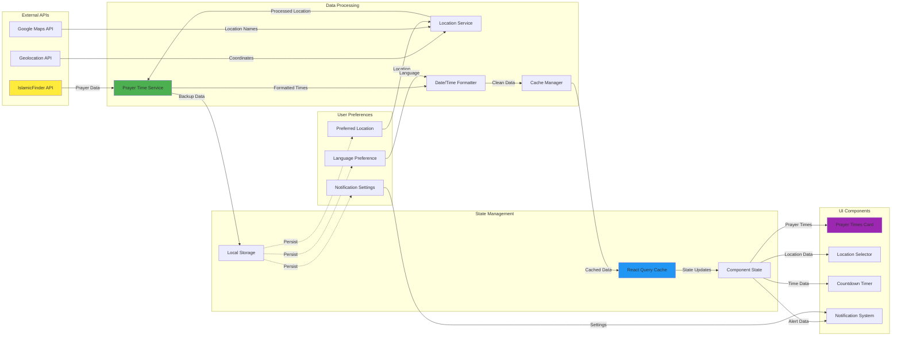
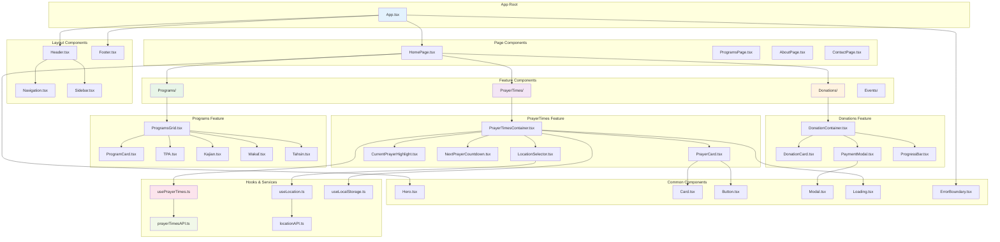
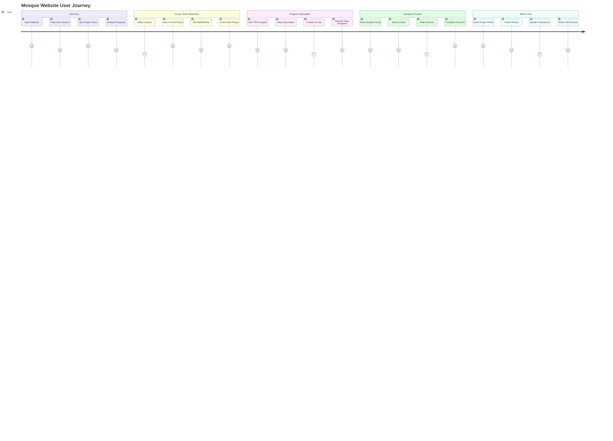
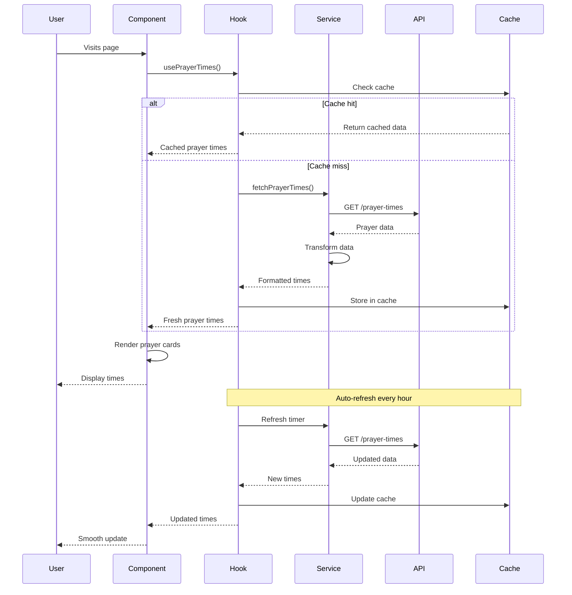
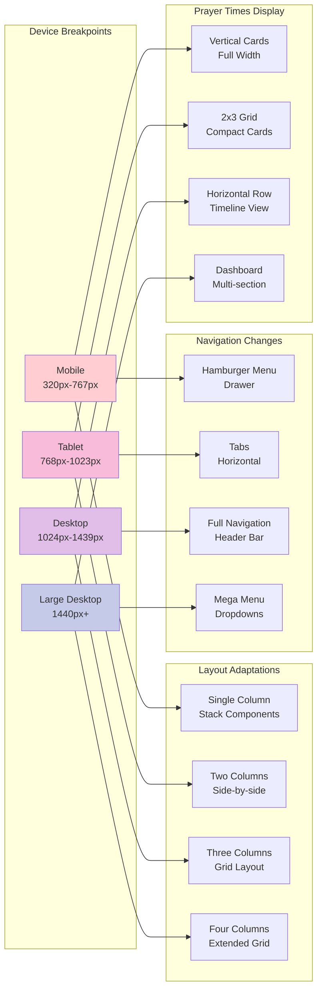

# Mosque Website - System Architecture Diagrams

## 1. Flow Control Diagram

## 2. Data Lineage Diagram

## 3. Component Structure Diagram

## 4. User Journey Flow

## 5. API Integration Flow

## 6. Responsive Breakpoint Strategy

## Color Scheme for Diagrams

The diagrams use a consistent color scheme reflecting the mosque website design:

- **Light Blue (#e3f2fd)**: Main components and containers
- **Green (#e8f5e8)**: Data flow and services
- **Purple (#f3e5f5)**: Features and functionality
- **Orange (#fff3e0)**: User interactions and external APIs
- **Pink (#fce4ec)**: Hooks and state management
- **Yellow (#ffeb3b)**: External data sources

This color coding helps developers quickly identify component types and data flow patterns throughout the system architecture.